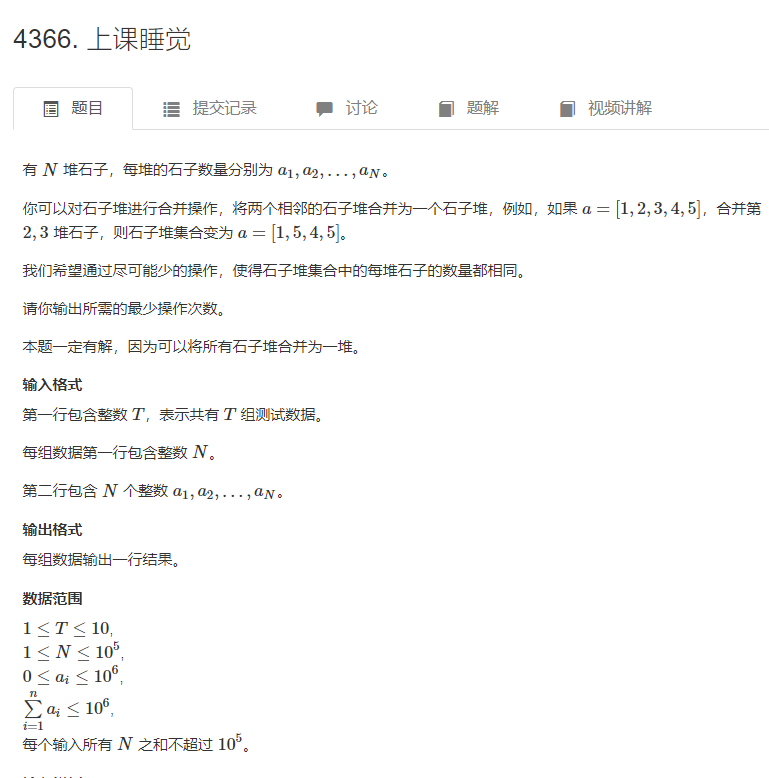
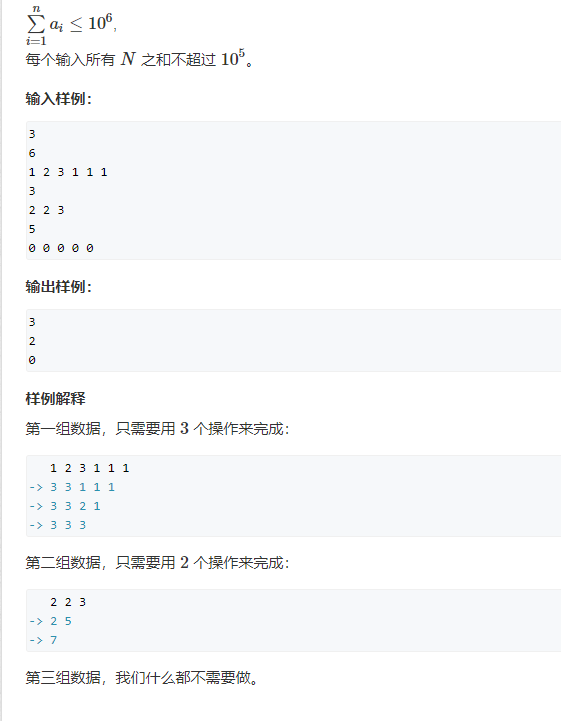
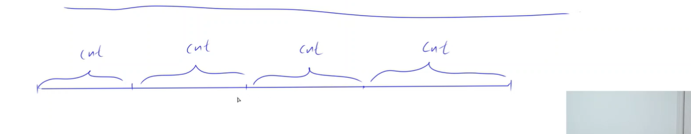

[题目链接](https://www.acwing.com/problem/content/description/4369/)




[yxc讲解视频](https://www.acwing.com/video/4576/)

解题思路：
设最后每堆石头的个数为n

那么n一定大于等于初始石堆中个数最多的个数，且小于所有石碓石头个数的合

那么可以在max和sum之间枚举可能的情况

分析可得n一定可以整除sum
```java
n%sum==0
```

可以通过这个条件减少枚举

通过记忆可得，100w里约数最多的数是720720 有240个 （int范围内 约数最多的数是2095133040 有1600个约数）

那么需要判断的数最多只有240个  时间复杂度可以接受

如何判断这个数可行，

因为合并石头堆是和相邻的合并，那么最后的石头堆一定是相邻（连续）的石头堆拼成的

那么可以想到前缀和

可以在哦o（N）的时间内判断是否可行 


