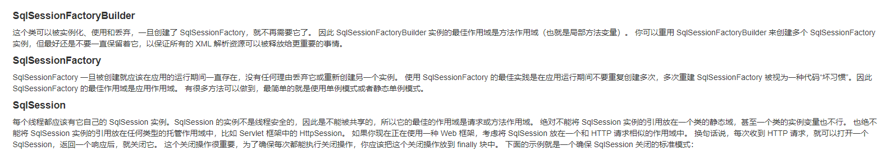

数据库
```sql
create table `user`(
    `id` int(20) not null primary key ,
    `name` varchar(30) default null,
    `pwd` varchar(30) default null

)engine = INNODB default charset =utf8;

insert into `user` values
(1,'袁佳林','123'),
(2,'杨帆','555666'),
(3,'网管','5151');
```


mybatis的三个 核心接口

SqlSessionFactory
SqlSessionFactoryBuilder
sqlSession



```java

//获取sqlSessionFactory对象
public class MybatisUtils {

    private  static  SqlSessionFactory sqlSessionFactory;
    static {
        String resource="mybatis-config.xml";
        try {
            InputStream inputStream = Resources.getResourceAsStream(resource);
            sqlSessionFactory=new SqlSessionFactoryBuilder().build(inputStream);
        } catch (IOException e) {
            throw new RuntimeException(e);
        }

    }
    public static SqlSession getSqlSession(){
        return sqlSessionFactory.openSession();

    }


}


```

**增删改需要提交事务**
