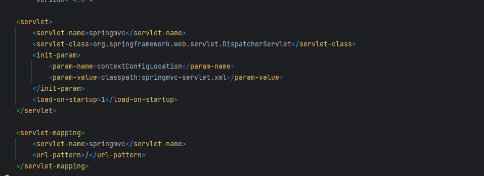
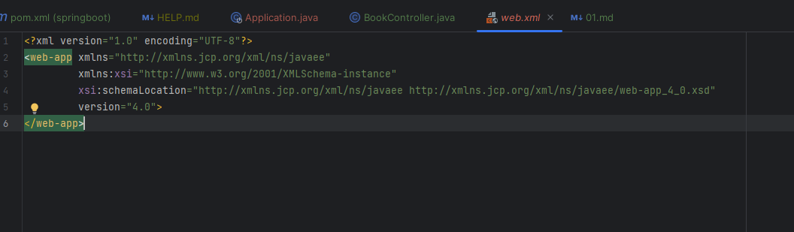
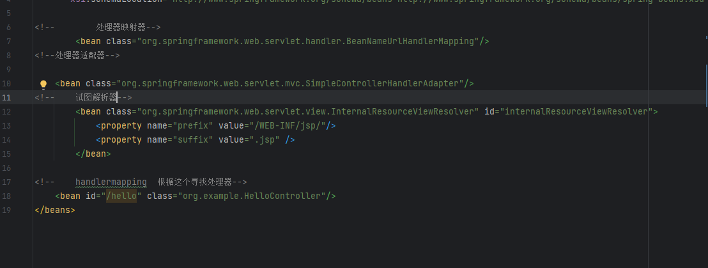

第一个spring boot程序与springmvc的差别

springmvc 需要在web.xml中配置 dispatchservlet 以拦截请求并将请求转发到对应的controller

而在springboot中则不需要手动配置dispatchservlet

springmvc中还要注册bean类 处理器映射器 试图解析器 处理器适配器

而在springboot中无需编写

