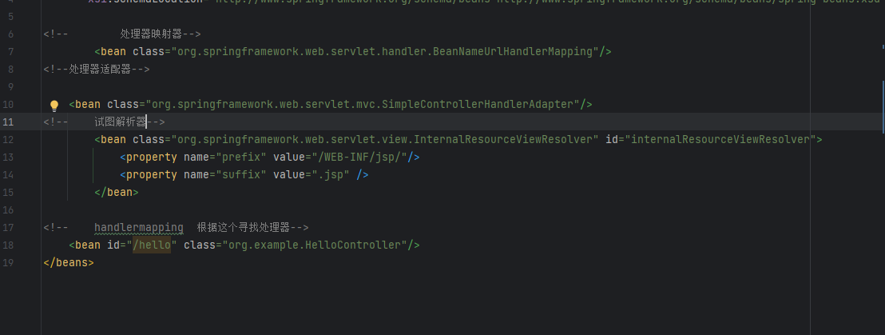
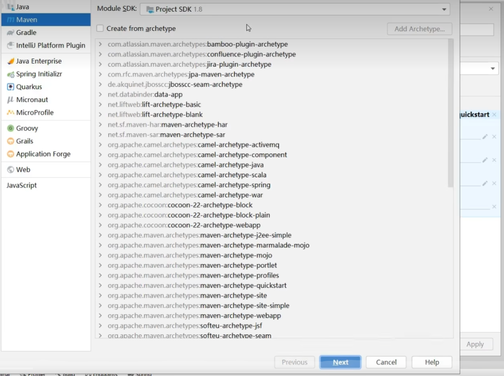
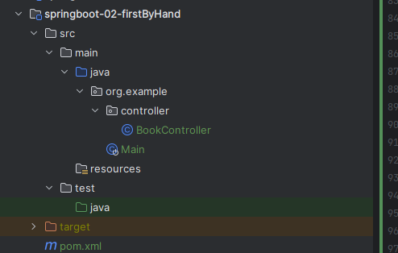

第一个spring boot程序与springmvc的差别

springmvc 需要在web.xml中配置 dispatchservlet 以拦截请求并将请求转发到对应的controller


而在springboot中则不需要手动配置dispatchservlet


springmvc中还要注册bean类 处理器映射器 试图解析器 处理器适配器



而在springboot中无需编写

并且springboot中不需要在配置文件中注册controller springboot可以自动找到他


如果spring官网上不去 导致创建不了
可以通过阿里云创建


如果电脑没网 那么先创建一个maven项目

在pom.xml中添加(从现成的springboot项目中直接拷贝)

```xml

<dependencies>
        <dependency>
            <groupId>org.springframework.boot</groupId>
            <artifactId>spring-boot-starter</artifactId>
        </dependency>

        <dependency>
            <groupId>org.springframework.boot</groupId>
            <artifactId>spring-boot-starter-test</artifactId>
            <scope>test</scope>
        </dependency>
        <dependency>
            <groupId>org.springframework.boot</groupId>
            <artifactId>spring-boot-starter-web</artifactId>
        </dependency>
        <dependency>
            <groupId>org.springframework.boot</groupId>
            <artifactId>spring-boot-starter-web</artifactId>
        </dependency>
        <dependency>
            <groupId>org.springframework.boot</groupId>
            <artifactId>spring-boot-starter-web</artifactId>
        </dependency>
    </dependencies>

    <build>
        <plugins>
            <plugin>
                <groupId>org.springframework.boot</groupId>
                <artifactId>spring-boot-maven-plugin</artifactId>
            </plugin>
        </plugins>
    </build>


```
加上这个
```java

import org.springframework.boot.SpringApplication;
import org.springframework.boot.autoconfigure.SpringBootApplication;

@SpringBootApplication
public class Main {
    public static void main(String[] args) {
        SpringApplication.run(Main.class, args);
    }
}

```

编写controller
```java

import org.springframework.web.bind.annotation.GetMapping;
import org.springframework.web.bind.annotation.RequestMapping;
import org.springframework.web.bind.annotation.RestController;

@RestController
@RequestMapping("/books")
public class BookController {

    @GetMapping
    public String getById(){
        System.out.println("springboot is running2");
        return "springboot is running2";
    }
}

```

最后结构为


分析spring和springboot的缺点和优点


将包和版本分开管理

集中管理版本能保证不同包之间能相互兼容,不会形成版本冲突的 情况(springboot直接规定了相应的包需要用那个版本)
在pom.xml 中

```xml
<parent>
        <groupId>org.springframework.boot</groupId>
        <artifactId>spring-boot-starter-parent</artifactId>
        <version>3.0.2</version>
        <relativePath/> <!-- lookup parent from repository -->
    </parent>
```
这个规定了 每个包对应的版本
```xml
  <angus-mail.version>1.0.0</angus-mail.version>
    <artemis.version>2.26.0</artemis.version>
    <aspectj.version>1.9.19</aspectj.version>
    <assertj.version>3.23.1</assertj.version>
    <awaitility.version>4.2.0</awaitility.version>
    <brave.version>5.14.1</brave.version>
    <build-helper-maven-plugin.version>3.3.0</build-helper-maven-plugin.version>
    <byte-buddy.version>1.12.22</byte-buddy.version>
    <cache2k.version>2.6.1.Final</cache2k.version>
    <caffeine.version>3.1.2</caffeine.version>
    <cassandra-driver.version>4.15.0</cassandra-driver.version>
    <classmate.version>1.5.1</classmate.version>
    <commons-codec.version>1.15</commons-codec.version>
    <commons-dbcp2.version>2.9.0</commons-dbcp2.version>

```

下面是依赖管理(通过依赖管理 我们在导入相应包时不需要制度版本 )
```xml
<dependencies>
      <dependency>
        <groupId>org.eclipse.angus</groupId>
        <artifactId>angus-core</artifactId>
        <version>${angus-mail.version}</version>
      </dependency>
      <dependency>
        <groupId>org.eclipse.angus</groupId>
        <artifactId>angus-mail</artifactId>
        <version>${angus-mail.version}</version>
      </dependency>
      <dependency>
        <groupId>org.eclipse.angus</groupId>
        <artifactId>angus-dsn</artifactId>
        <version>${angus-mail.version}</version>
      </dependency>
```