第一个spring boot程序与springmvc的差别

springmvc 需要在web.xml中配置 dispatchservlet 以拦截请求并将请求转发到对应的controller
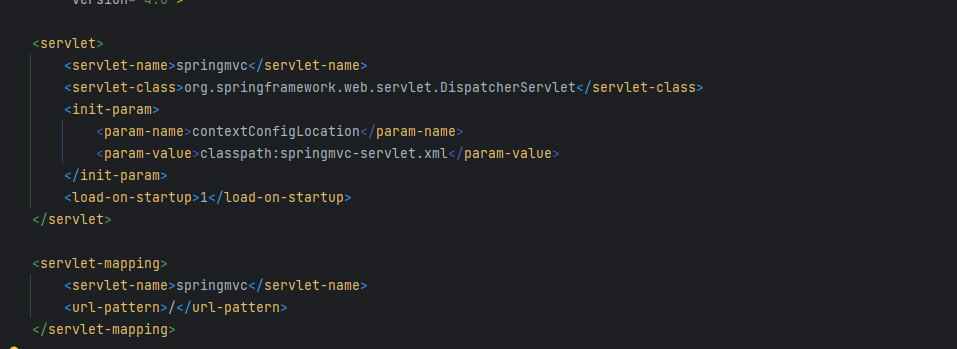

而在springboot中则不需要手动配置dispatchservlet
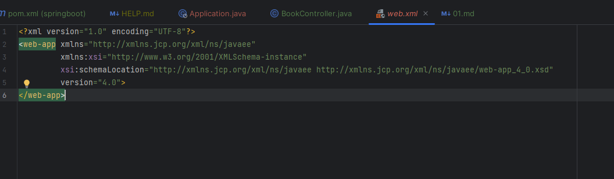

springmvc中还要注册bean类 处理器映射器 试图解析器 处理器适配器
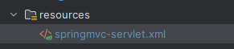
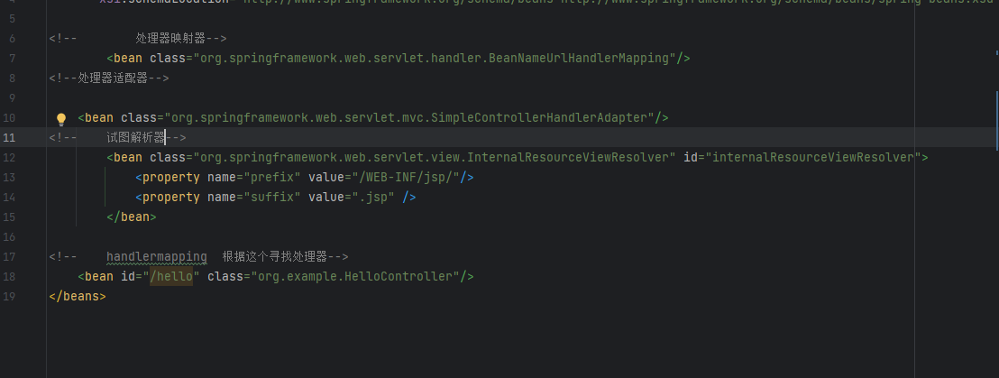

而在springboot中无需编写

并且springboot中不需要在配置文件中注册controller springboot可以自动找到他


如果spring官网上不去 导致创建不了
可以通过阿里云创建
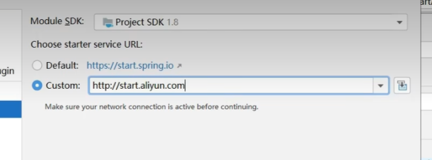

如果电脑没网 那么先创建一个maven项目
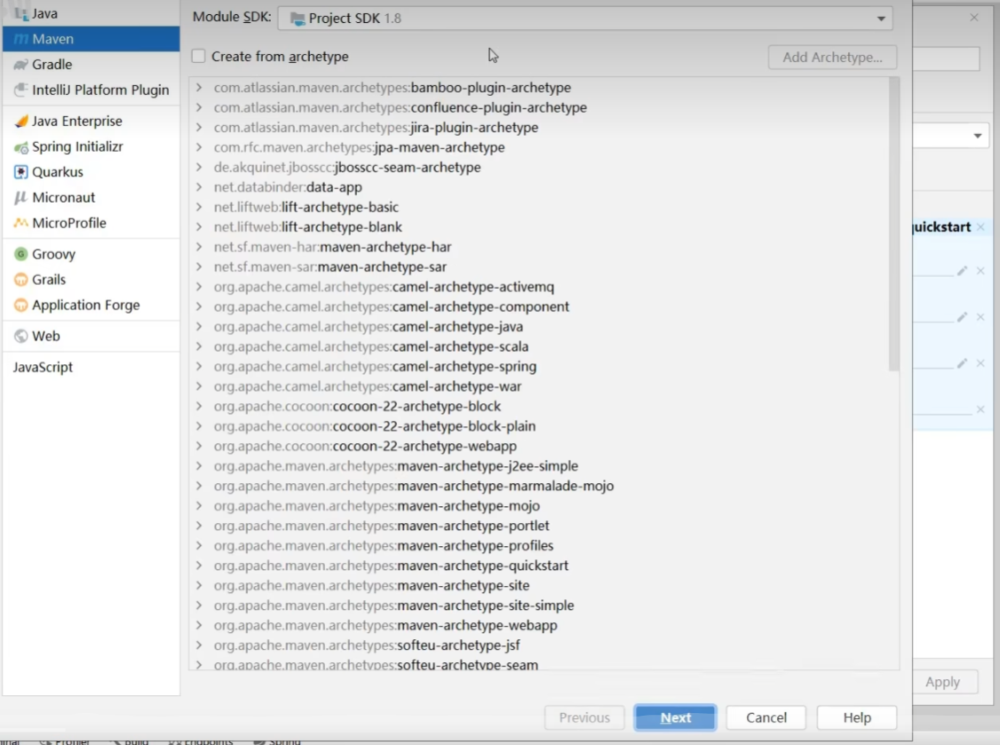
在pom.xml中添加(从现成的springboot项目中直接拷贝)

```xml

<dependencies>
        <dependency>
            <groupId>org.springframework.boot</groupId>
            <artifactId>spring-boot-starter</artifactId>
        </dependency>

        <dependency>
            <groupId>org.springframework.boot</groupId>
            <artifactId>spring-boot-starter-test</artifactId>
            <scope>test</scope>
        </dependency>
        <dependency>
            <groupId>org.springframework.boot</groupId>
            <artifactId>spring-boot-starter-web</artifactId>
        </dependency>
        <dependency>
            <groupId>org.springframework.boot</groupId>
            <artifactId>spring-boot-starter-web</artifactId>
        </dependency>
        <dependency>
            <groupId>org.springframework.boot</groupId>
            <artifactId>spring-boot-starter-web</artifactId>
        </dependency>
    </dependencies>

    <build>
        <plugins>
            <plugin>
                <groupId>org.springframework.boot</groupId>
                <artifactId>spring-boot-maven-plugin</artifactId>
            </plugin>
        </plugins>
    </build>


```
加上这个
```java

import org.springframework.boot.SpringApplication;
import org.springframework.boot.autoconfigure.SpringBootApplication;

@SpringBootApplication
public class Main {
    public static void main(String[] args) {
        SpringApplication.run(Main.class, args);
    }
}

```

编写controller
```java

import org.springframework.web.bind.annotation.GetMapping;
import org.springframework.web.bind.annotation.RequestMapping;
import org.springframework.web.bind.annotation.RestController;

@RestController
@RequestMapping("/books")
public class BookController {

    @GetMapping
    public String getById(){
        System.out.println("springboot is running2");
        return "springboot is running2";
    }
}

```

最后结构为
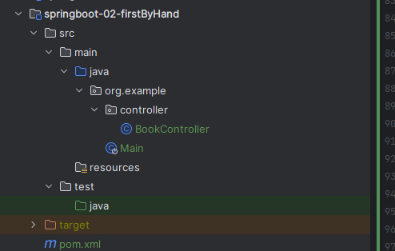

分析spring和springboot的缺点和优点

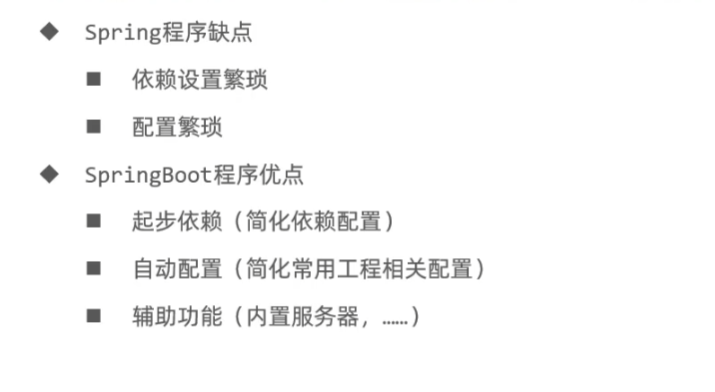

将包和版本分开管理
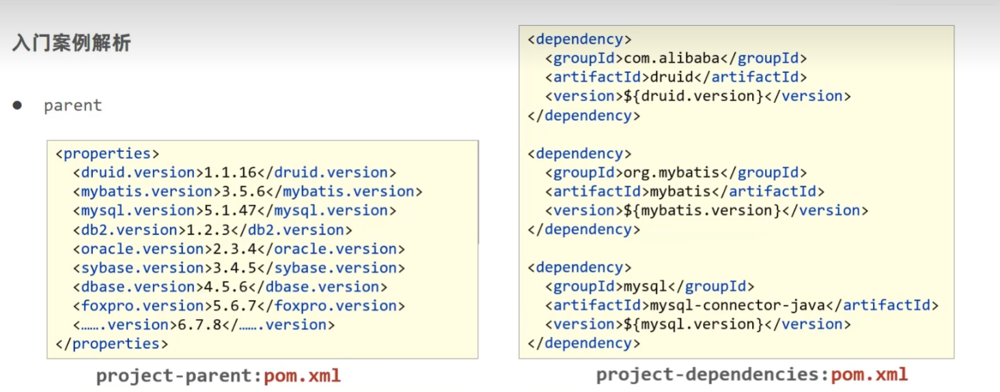
集中管理版本能保证不同包之间能相互兼容,不会形成版本冲突的 情况(springboot直接规定了相应的包需要用那个版本)
在pom.xml 中

```xml
<parent>
        <groupId>org.springframework.boot</groupId>
        <artifactId>spring-boot-starter-parent</artifactId>
        <version>3.0.2</version>
        <relativePath/> <!-- lookup parent from repository -->
    </parent>
```
这个规定了 每个包对应的版本
```xml
  <angus-mail.version>1.0.0</angus-mail.version>
    <artemis.version>2.26.0</artemis.version>
    <aspectj.version>1.9.19</aspectj.version>
    <assertj.version>3.23.1</assertj.version>
    <awaitility.version>4.2.0</awaitility.version>
    <brave.version>5.14.1</brave.version>
    <build-helper-maven-plugin.version>3.3.0</build-helper-maven-plugin.version>
    <byte-buddy.version>1.12.22</byte-buddy.version>
    <cache2k.version>2.6.1.Final</cache2k.version>
    <caffeine.version>3.1.2</caffeine.version>
    <cassandra-driver.version>4.15.0</cassandra-driver.version>
    <classmate.version>1.5.1</classmate.version>
    <commons-codec.version>1.15</commons-codec.version>
    <commons-dbcp2.version>2.9.0</commons-dbcp2.version>

```

下面是依赖管理(通过依赖管理 我们在导入相应包时不需要制度版本 )
```xml
<dependencies>
      <dependency>
        <groupId>org.eclipse.angus</groupId>
        <artifactId>angus-core</artifactId>
        <version>${angus-mail.version}</version>
      </dependency>
      <dependency>
        <groupId>org.eclipse.angus</groupId>
        <artifactId>angus-mail</artifactId>
        <version>${angus-mail.version}</version>
      </dependency>
      <dependency>
        <groupId>org.eclipse.angus</groupId>
        <artifactId>angus-dsn</artifactId>
        <version>${angus-mail.version}</version>
      </dependency>
```

虽然有了依赖管理，那么是怎么使用的了

点开带有starter的依赖，如下
```xml
 <dependency>
            <groupId>org.springframework.boot</groupId>
            <artifactId>spring-boot-starter</artifactId>
        </dependency>

```

可在里面看见
```xml
<dependency>
      <groupId>org.springframework.boot</groupId>
      <artifactId>spring-boot</artifactId>
      <version>3.0.2</version>
      <scope>compile</scope>
    </dependency>
    <dependency>
      <groupId>org.springframework.boot</groupId>
      <artifactId>spring-boot-autoconfigure</artifactId>
      <version>3.0.2</version>
      <scope>compile</scope>
    </dependency>
    <dependency>
      <groupId>org.springframework.boot</groupId>
      <artifactId>spring-boot-starter-logging</artifactId>
      <version>3.0.2</version>
      <scope>compile</scope>
    </dependency>

```
可见其有了版本号

一个start代表某项技术,其中定义了该项技术可能需要用到的包和其版本
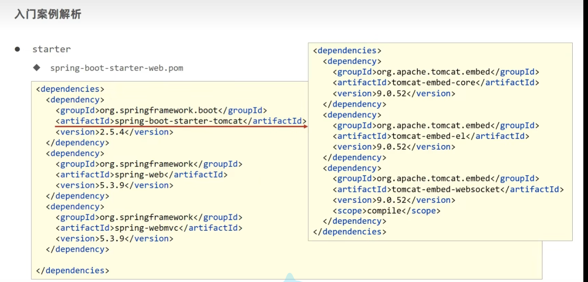
starter中也可以包含其他starter

注意区分之前的parent 和starter
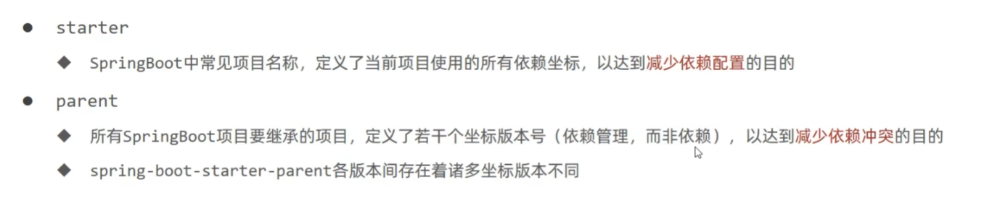

parent和starter都是为了解决配置问题的
但光做配置不行,程序的运行还需要引导类

## 引导类

这就是引导类
```java
import org.springframework.boot.SpringApplication;
import org.springframework.boot.autoconfigure.SpringBootApplication;

@SpringBootApplication
public class Application {

    public static void main(String[] args) {
        SpringApplication.run(Application.class, args);
    }

}

```

```java
import com.example.springboot03guidanceclass.controller.BookController;
import org.springframework.boot.SpringApplication;
import org.springframework.boot.autoconfigure.SpringBootApplication;
import org.springframework.context.ConfigurableApplicationContext;


@SpringBootApplication
public class Springboot03GuidanceClassApplication {

    public static void main(String[] args) {
//        从这可以看出run是一个ApplicationContext
        ConfigurableApplicationContext run = SpringApplication.run(Springboot03GuidanceClassApplication.class, args);
        //那么就可以从中取出注册的bean,虽然我们没有编写ApplicationContext.xml 但通过注解 springboot已经帮我们注册了bean,故可以拿出
        System.out.println(run.getBean(BookController.class));

        System.out.println(run.getBean("user"));
    }

}

```
这个类最特殊的地方在于@SpringBootApplication
点进注释
```java
import java.lang.annotation.Documented;
import java.lang.annotation.ElementType;
import java.lang.annotation.Inherited;
import java.lang.annotation.Retention;
import java.lang.annotation.RetentionPolicy;
import java.lang.annotation.Target;
import org.springframework.beans.factory.support.BeanNameGenerator;
import org.springframework.boot.SpringBootConfiguration;
import org.springframework.boot.context.TypeExcludeFilter;
import org.springframework.context.annotation.ComponentScan;
import org.springframework.context.annotation.Configuration;
import org.springframework.context.annotation.FilterType;
import org.springframework.context.annotation.ComponentScan.Filter;
import org.springframework.core.annotation.AliasFor;

@Target({ElementType.TYPE})
@Retention(RetentionPolicy.RUNTIME)
@Documented
@Inherited
@SpringBootConfiguration
@EnableAutoConfiguration
@ComponentScan(
    excludeFilters = {@Filter(
    type = FilterType.CUSTOM,
    classes = {TypeExcludeFilter.class}
), @Filter(
    type = FilterType.CUSTOM,
    classes = {AutoConfigurationExcludeFilter.class}
)}
)
public @interface SpringBootApplication {
    @AliasFor(
        annotation = EnableAutoConfiguration.class
    )
    Class<?>[] exclude() default {};

    @AliasFor(
        annotation = EnableAutoConfiguration.class
    )
    String[] excludeName() default {};

    @AliasFor(
        annotation = ComponentScan.class,
        attribute = "basePackages"
    )
    String[] scanBasePackages() default {};

    @AliasFor(
        annotation = ComponentScan.class,
        attribute = "basePackageClasses"
    )
    Class<?>[] scanBasePackageClasses() default {};

    @AliasFor(
        annotation = ComponentScan.class,
        attribute = "nameGenerator"
    )
    Class<? extends BeanNameGenerator> nameGenerator() default BeanNameGenerator.class;

    @AliasFor(
        annotation = Configuration.class
    )
    boolean proxyBeanMethods() default true;
}
```

点进其中的@SpringBootConfiguration
```java
import java.lang.annotation.Documented;
import java.lang.annotation.ElementType;
import java.lang.annotation.Retention;
import java.lang.annotation.RetentionPolicy;
import java.lang.annotation.Target;
import org.springframework.context.annotation.Configuration;
import org.springframework.core.annotation.AliasFor;
import org.springframework.stereotype.Indexed;

@Target({ElementType.TYPE})
@Retention(RetentionPolicy.RUNTIME)
@Documented
@Configuration
@Indexed
public @interface SpringBootConfiguration {
    @AliasFor(
        annotation = Configuration.class
    )
    boolean proxyBeanMethods() default true;
}


```

可知引导类本质是一个配置类

@ComponentScan也告诉我们为什么可以通过注解注册bean

添加了@ComponentScan springboot会扫描该类所在包及其子包下的类


## 内嵌tomcat


在pom中可以看见如下代码
```xml
<dependency>
      <groupId>org.apache.tomcat.embed</groupId>
      <artifactId>tomcat-embed-core</artifactId>
      <version>9.0.65</version>
      <scope>compile</scope>
      <exclusions>
        <exclusion>
          <artifactId>tomcat-annotations-api</artifactId>
          <groupId>org.apache.tomcat</groupId>
        </exclusion>
      </exclusions>
    </dependency>
```
<artifactId>tomcat-embed-core</artifactId>表明内嵌tomcat核心

tomcat是通过java语言写的

springboot 将一个tomcat程序的执行过程抽取出来成为一个对象,把这个对象交给spring容器进行管理

既然是一个对象 我们就可以不用它

先在依赖中排除tomcat

```xml
        <dependency>
            <groupId>org.springframework.boot</groupId>
            <artifactId>spring-boot-starter-web</artifactId>

<!--     自己添加的 用于排除tomcat相关的依赖       -->
            <exclusions>
                <exclusion>
                    <groupId>org.springframework.boot</groupId>
                    <artifactId>spring-boot-starter-tomcat</artifactId>
                </exclusion>
            </exclusions>
<!--            -->
            
        </dependency>
```

添加新的服务器依赖
```xml
<!--添加新的服务器依赖-->
        <dependency>
            <groupId>org.springframework.boot</groupId>
            <artifactId>spring-boot-starter-jetty</artifactId>
        </dependency>
```
