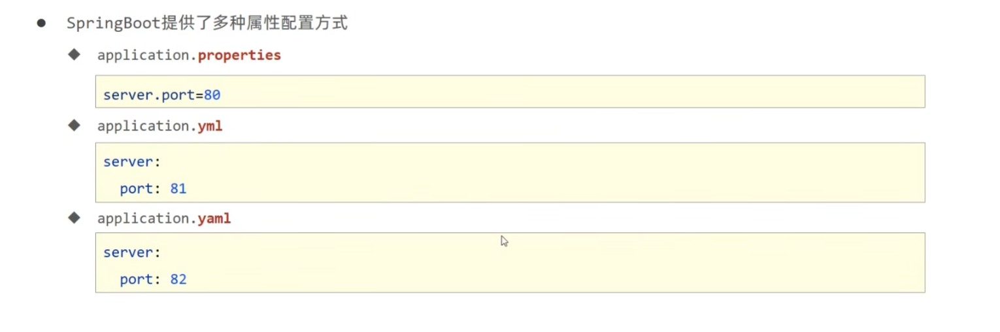

spring boot的的配置文件是application.propertie

更改端口号也在里面

```properties
spring.application.name=springboot-05-BaseConfiguration
#设置端口号
server.port=9999

#关闭banner(off关闭,console 输出在控制台上,log 输出在日志上)
spring.main.banner-mode=console
#将一个图片设置为banner
spring.banner.image.location=2.jpg
#设置根日志的级别
logging.level.root=error

# 并不是官网(https://docs.spring.io/spring-boot/docs/current/reference/html/application-properties.html#appendix.application-properties)
# 所有配置都可以无脑的往里面写,相关的配置需要与使用的技术相对应


```
这种格式写配置 写多了也会晕


yaml
```yaml
server:
  port: 9999
```
yml
```yml
server:
  port: 9999
```
优先级:properties>yml>yaml
不同配置中的相同配置按照优先级覆盖,不同配置文件中的不同配置全部保留


从yaml中读数据

```java
@Value("${country}")
    String c;
```
```yaml
country: china
```


```java
@Value("${user1.name}")
    String name;
```
```yaml
user1:
  name: 杨帆
```

```java
@Value("${hoppy[0]}")
    String hoppy;
```
```yaml
hoppy:
  - eat
  - sleep
  - play
```

也可以在配置文件中相互引用
```yaml
hoppy:
  - eat
  - sleep
  - play


app: ${hoppy[1]}dog
```