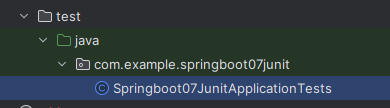

junit测试文件只能在这个文件位置，如果想换位置需要进行修改

原样
```java

import org.junit.jupiter.api.Test;
import org.springframework.boot.test.context.SpringBootTest;

@SpringBootTest
class Springboot07JunitApplicationTests {

    @Test
    void contextLoads() {
    }

}


```

如果想更改位置

需要加上引导类的类名

```java
import org.junit.jupiter.api.Test;
import org.springframework.boot.test.context.SpringBootTest;

@SpringBootTest(classes = Springboot07JunitApplication.class)
class Springboot07JunitApplicationTests {

    @Test
    void contextLoads() {
    }

}

```


