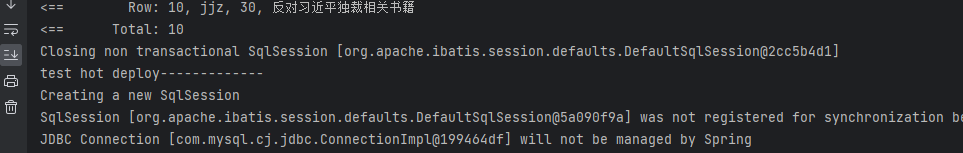
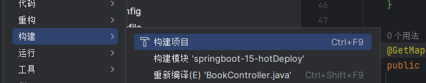
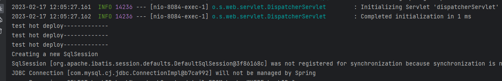
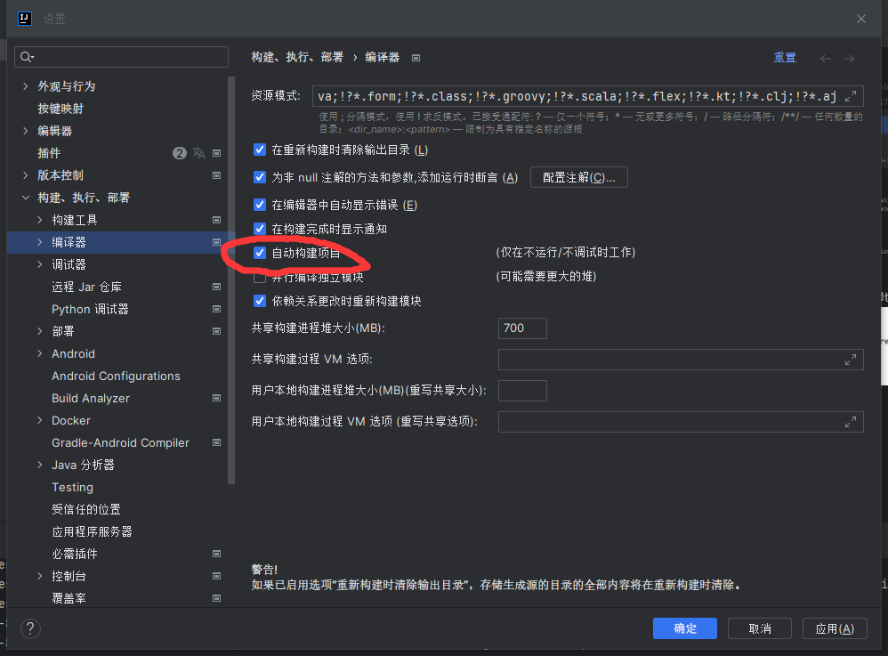
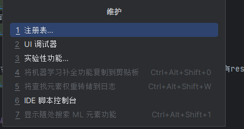
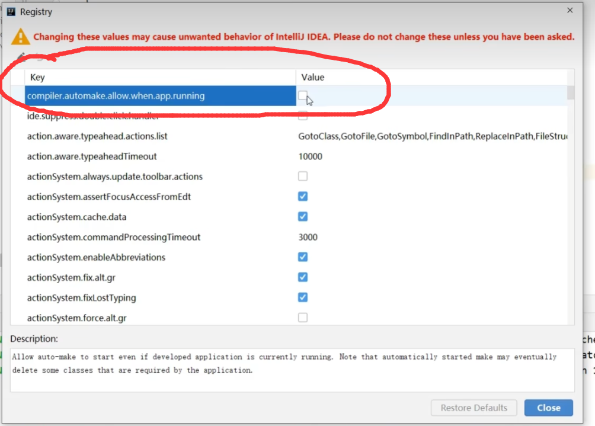
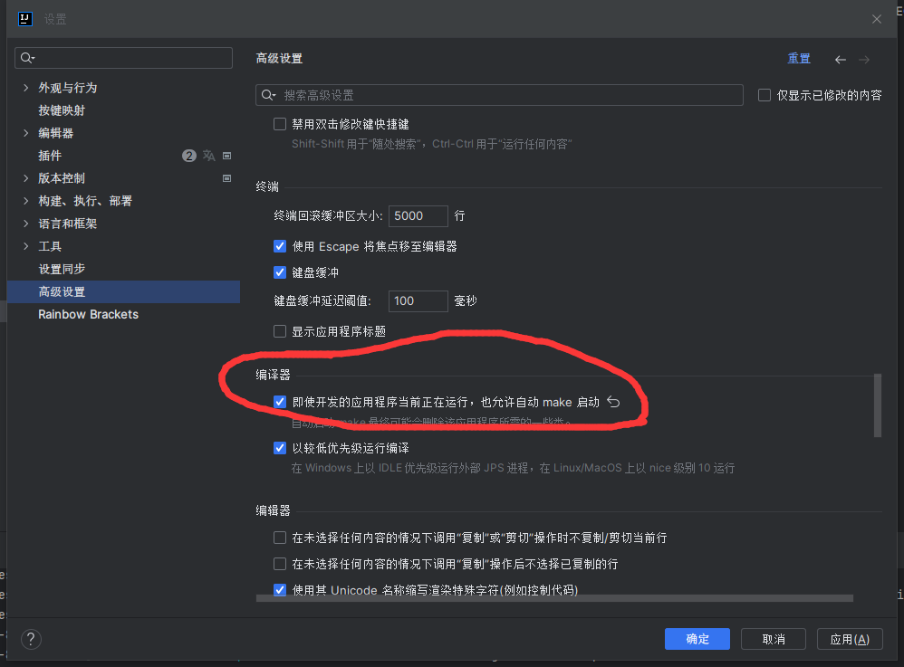
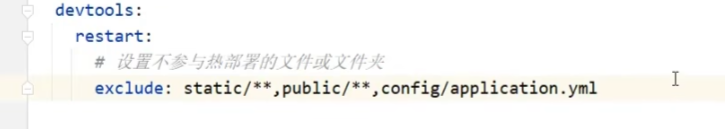

# 手动热部署
添加依赖
```xml
<dependency>
            <groupId>org.springframework.boot</groupId>
            <artifactId>spring-boot-devtools</artifactId>
</dependency>
```

测试
```java
@GetMapping("/select/{id}")
    public R getBookById(@PathVariable Integer id) {

        System.out.println("test hot deploy-------------");
        return new R(true, iBookService.getById(id));
    }

```


在不重启的情况下将java代码改成
```java
 @GetMapping("/select/{id}")
    public R getBookById(@PathVariable Integer id) {

        System.out.println("test hot deploy-------------");
        System.out.println("test hot deploy-------------");
        System.out.println("test hot deploy-------------");
        return new R(true, iBookService.getById(id));
    }


```
构建项目

重新测试



热部署时只有restart 没有reload 在程序第一次启动时 有reload也有restart


# 自动启动热部署
在上面的基础上


然后通过快捷键 ctlr+alt+shift+/ 打开

打开register(注册表)


新版在下面的地方


然后在idea失去焦点后的5s内会自动构建

排除不参加热部署的文件
